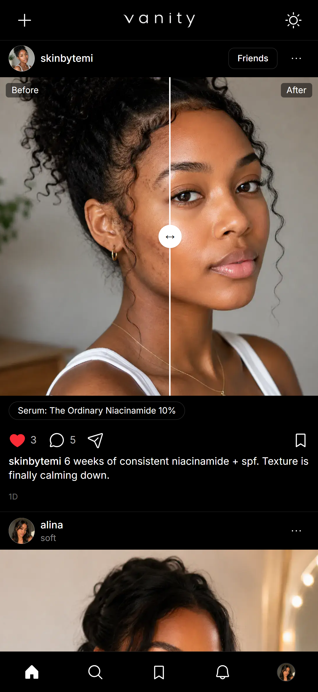
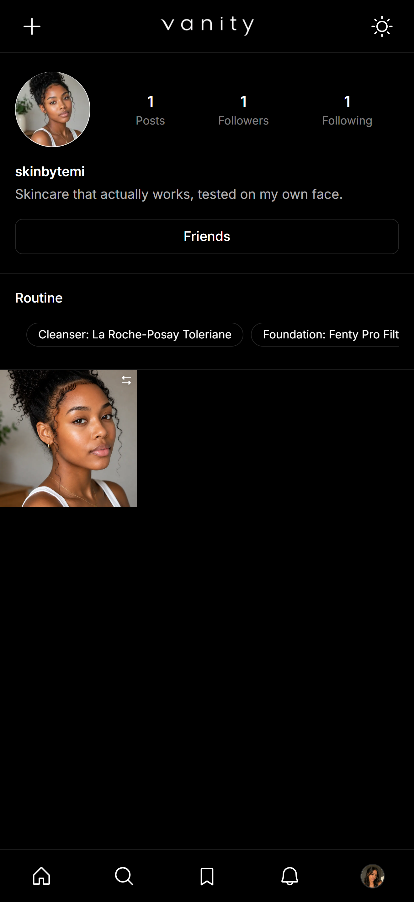

# Vanity

A beauty-focused social platform inspired by Instagram — share looks, tag the products you used, pin your routine, and follow the creators you love.

Built with Next.js 16 (App Router), Prisma + PostgreSQL, and Cloudinary.



## Features

- **Passwordless auth** — sign in with a magic link sent to your email (no passwords, no OAuth), backed by short-lived access tokens + rotating refresh tokens
- **Rich post types** — single image, video, multi-slide carousel, and side-by-side **before/after** posts
- **Product tagging** — attach product chips to a post (e.g. "Foundation: Fenty Pro Filt'r 240")
- **Pinned routines** — a profile section for your go-to skincare/makeup routine, separate from post tags
- **Social graph** — follow/unfollow, followers & following lists
- **Engagement** — likes and threaded comments (with comment likes) on posts
- **Saves & collections** — save posts into named collections, not just a single bookmarks list
- **Explore** — search and discover posts and users
- **Notifications** — likes, comments, and follows surfaced in a notifications feed
- **Onboarding flow** — guided setup for new accounts

## Tech stack

| Layer         | Choice                                                                                    |
| ------------- | ----------------------------------------------------------------------------------------- |
| Framework     | [Next.js 16](https://nextjs.org) (App Router, Route Handlers)                             |
| UI            | React 19, Tailwind CSS 4, Phosphor Icons                                                  |
| Data fetching | TanStack Query                                                                            |
| Database      | PostgreSQL via [Prisma ORM](https://www.prisma.io) (driver adapter: `@prisma/adapter-pg`) |
| Media         | [Cloudinary](https://cloudinary.com) (upload + delivery)                                  |
| Auth          | JWT access/refresh tokens + magic links via [Resend](https://resend.com)                  |

## Getting started

### Prerequisites

- Node.js 20+
- A PostgreSQL database
- A [Cloudinary](https://cloudinary.com) account
- A [Resend](https://resend.com) account (for sending magic-link emails)

### Setup

1. Clone the repo and install dependencies:

   ```bash
   git clone https://github.com/<your-username>/vanity.git
   cd vanity
   npm install
   ```

2. Copy the example env file and fill in your own values:

   ```bash
   cp .env.example .env
   ```

   | Variable                | Description                                       |
   | ----------------------- | ------------------------------------------------- |
   | `DATABASE_URL`          | PostgreSQL connection string                      |
   | `JWT_SECRET`            | Secret used to sign access tokens                 |
   | `RESEND_API_KEY`        | API key for sending magic-link emails             |
   | `CLOUDINARY_CLOUD_NAME` | Cloudinary cloud name                             |
   | `CLOUDINARY_API_KEY`    | Cloudinary API key                                |
   | `CLOUDINARY_API_SECRET` | Cloudinary API secret                             |
   | `NEXT_PUBLIC_SITE_URL`  | Public URL of the app (used in magic-link emails) |

3. Run database migrations:

   ```bash
   npx prisma migrate deploy
   ```

4. Start the dev server:

   ```bash
   npm run dev
   ```

   Open [http://localhost:3000](http://localhost:3000).

## Project structure

```
app/            Routes — pages under app/(home), app/explore, app/profile, etc., and API route handlers under app/api
components/     UI components, grouped by feature (feed, auth, profile, create, saved, notifications...)
hooks/          TanStack Query hooks (usePosts, useComments, useNotifications, ...)
lib/            Server-side domain logic (posts, users, likes, comments, notifications, auth, mailer)
services/       Client-side API service wrappers
prisma/         Schema and migrations
types/          Shared TypeScript types
utils/          Small shared helpers
```

## Screenshots

| Feed                                    | Post detail                               | Profile                                  |
| --------------------------------------- | ----------------------------------------- | ---------------------------------------- |
|  |  |  |

## License

MIT
